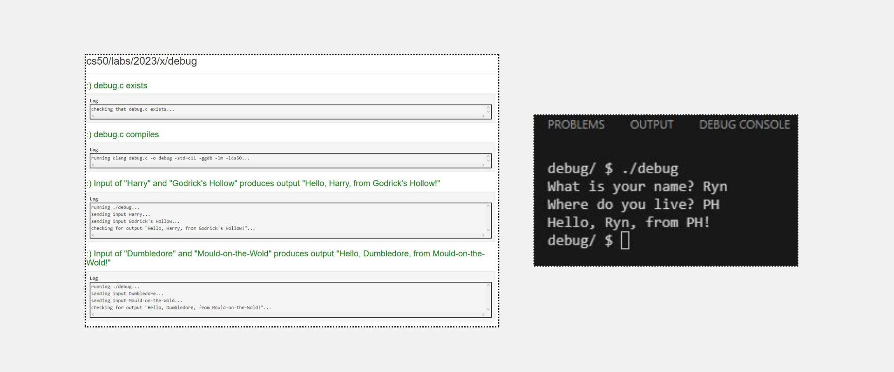
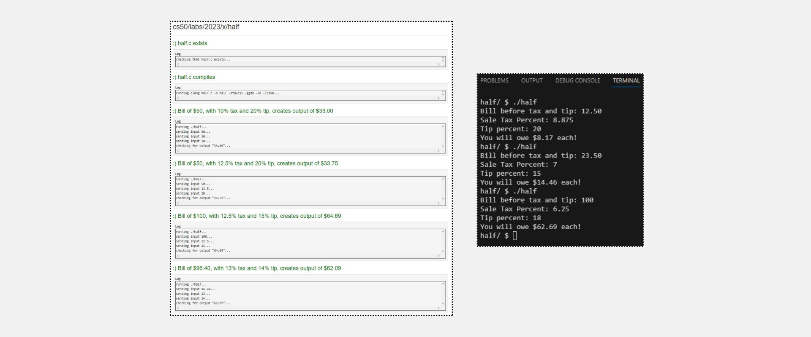

<h1>Debug</h1>
<h3>Learning Goals</h3>
<ul>
  <li>Become familiar with C syntax</li>
  <li>Learn what C compiler error messages mean</li>
  <li>Get practice debugging</li>
</ul>  
<h3>Output</h3>

<h1>Half</h1>
<h3>Learning Goals</h3>
<ul>
  <li>Work with different data types</li>
  <li>Practice type casting</li>
  <li>Use math operations</li>
  <li>Create a function with input parameters and return value</li>
</ul>  
<h3>Output</h3>

