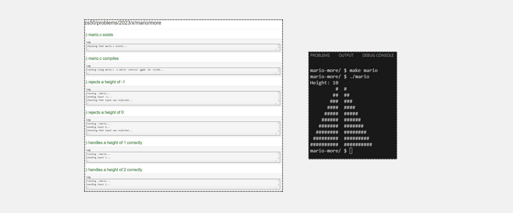

<h1>Lab 1 (Population)</h1>

<h3> Implementation Details </h3>

Complete the implementation of population.c, such that it calculates the number of years required for the population to grow from the start size to the end size.

<ul>
<li>Your program should first prompt the user for a starting population size.
<ul>  
<li>If the user enters a number less than 9 (the minimum allowed population size), the user should be re-prompted to enter a starting population size until they enter a number that is greater than or equal to 9. (If we start with fewer than 9 llamas, the population of llamas will quickly become stagnant!)</li>
</ul>
</li>
<li>Your program should then prompt the user for an ending population size.
<ul>  
<li>if the user enters a number less than the starting population size, the user should be re-prompted to enter an ending population size until they enter a number that is greater than or equal to the starting population size. (After all, we want the population of llamas to grow!)</li>
</ul>
</li>
<li>Your program should then calculate the (integer) number of years required for the population to reach at least the size of the end value.</li>
<li>Finally, your program should print the number of years required for the llama population to reach that end size, as by printing to the terminal Years: n, where n is the number of years.</li>
</ul>

<h4>Output</h4>

<h3>Check50 Result </h3>

<h1>Problem Set</h1>

<h3>Hello</h3>
<h4>Getting User Input</h4>

suffice it to say, no matter how you compile or execute this program, it only ever prints hello, world. Let’s personalize it a bit, just as we did in class.
Modify this program in such a way that it first prompts the user for their name and then prints hello, so-and-so, where so-and-so is their actual name.

<h3>Mario More</h3>

<h3>Credit</h3>

