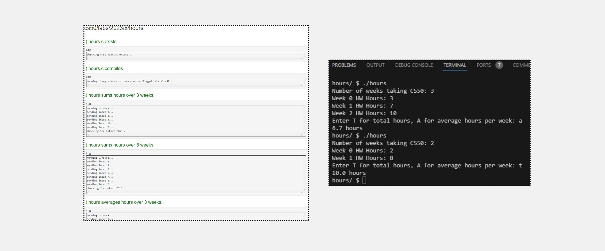
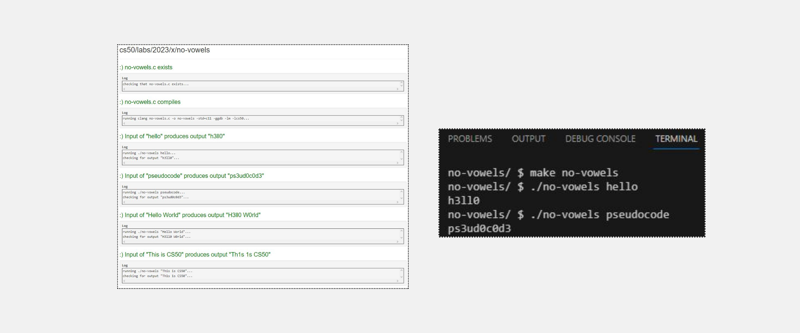
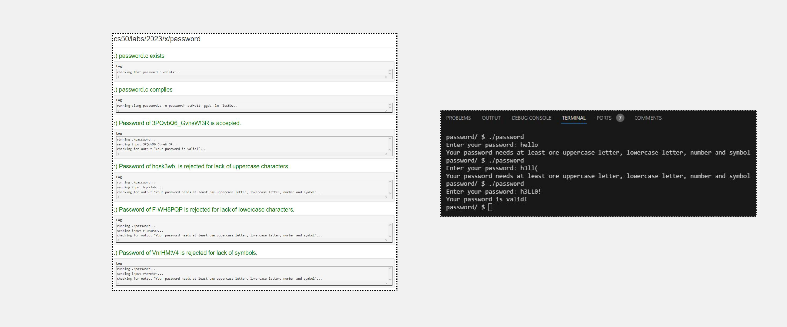

<h1>Hours</h1>
<h2>Learning Goals</h2>
<ul>
<li>
Practice using arrays
</li>
  <li>
Using an array as a parameter to a function
    </li>
    <li>
Adding values in a loop
      </li>
      <li>
Integer division and type casting
    </li>
</ul>
<h2>Output</h2>

---

<h2>Learning Goals</h2>
<ul>
<li>
Practice using strings
</li>
  <li>
Practice using command-line arguments
    </li>
    <li>
Write a program entirely from scratch
      </li>
</ul>
<h2>Output</h2>

---

<h2>Learning Goals</h2>
<ul>
<li>
Practice iterating through a string
</li>
  <li>
Practice using the ctype library
    </li>
    <li>
Practice using Boolean variables
      </li>
</ul>
<h2>Output</h2>

