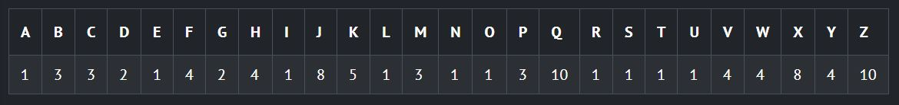
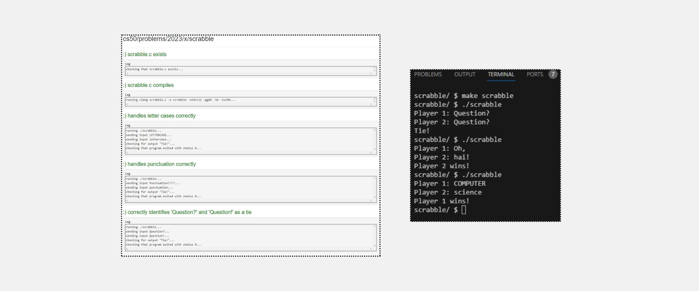
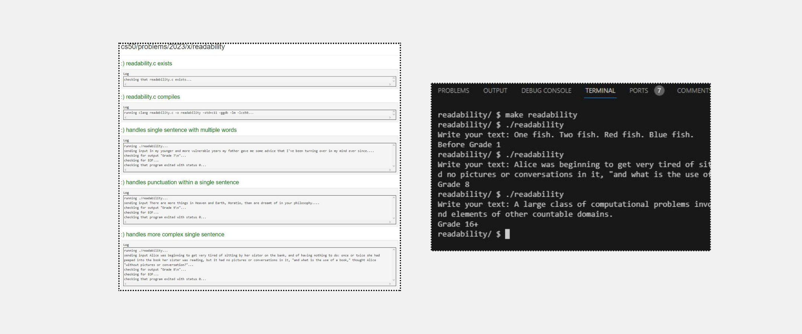
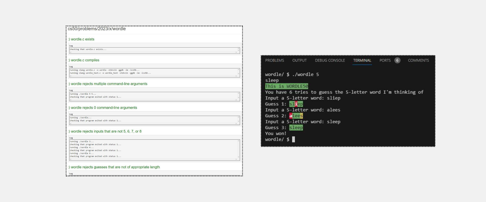

<h1>Lab 2: Scrabble</h1>
<h2>Implementation Details</h2>

<em>Complete the implementation of scrabble.c, such that it determines the winner of a short scrabble-like game, where two players each enter their word, and the higher scoring player wins.</em>

<ul>

<li>Notice that we’ve stored the point values of each letter of the alphabet in an integer array named POINTS.</li>
<ul>
  <li>For example, A or a is worth 1 point (represented by POINTS[0]), B or b is worth 3 points (represented by POINTS[1]), etc.</li>
</ul>

<li>Notice that we’ve created a prototype for a helper function called compute_score() that takes a string as input and returns an int. Whenever we would like to assign point values to a particular word, we can call this function. Note that this prototype is required for C to know that compute_score() exists later in the program.</li>

<li>In main(), the program prompts the two players for their words using the get_string() function. These values are stored inside variables named word1 and word2.</li>

<li>In compute_score(), your program should compute, using the POINTS array, and return the score for the string argument. Characters that are not letters should be given zero points, and uppercase and lowercase letters should be given the same point values.</li>
<ul><li>For example, ! is worth 0 points while A and a are both worth 1 point.</li>
<li>Though Scrabble rules normally require that a word be in the dictionary, no need to check for that in this problem!</li>
</ul>

<li>In main(), your program should print, depending on the players’ scores, Player 1 wins!, Player 2 wins!, or Tie!.</li>
</ul>
 

---

<h1>Problem Set 2</h1>
<h2>Readability</h2>
<h2>Specification</h2>

<em>Design and implement a program, readability, that computes the Coleman-Liau index of text.</em>

<ul>
<li>Implement your program in a file called readability.c in a directory called readability.</li>
  
<li>Your program must prompt the user for a string of text using get_string.</li>

<li>Your program should count the number of letters, words, and sentences in the text. You may assume that a letter is any lowercase character from a to z or any uppercase character from A to Z, any sequence of characters separated by spaces should count as a word, and that any occurrence of a period, exclamation point, or question mark indicates the end of a sentence.</li>

<li>Your program should print as output "Grade X" where X is the grade level computed by the Coleman-Liau formula, rounded to the nearest integer.</li>

<li>If the resulting index number is 16 or higher (equivalent to or greater than a senior undergraduate reading level), your program should output "Grade 16+" instead of giving the exact index number. If the index number is less than 1, your program should output "Before Grade 1".</li>  
</ul>
 

---
<h2>Wordle50</h2>

