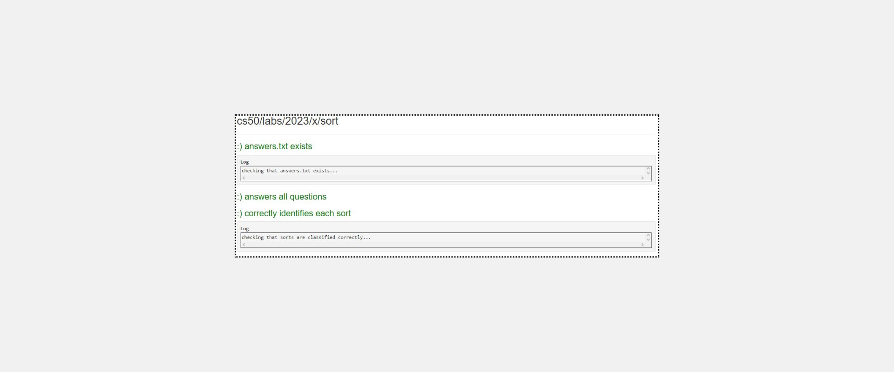

<h1>Instructions</h1>

Provided to you are three already-compiled C programs, sort1, sort2, and sort3. Each of these programs implements a different sorting algorithm: selection sort, bubble sort, or merge sort (though not necessarily in that order!). Your task is to determine which sorting algorithm is used by each file.

<ul>
<li>sort1, sort2, and sort3 are binary files, so you won’t be able to view the C source code for each. To assess which sort implements which algorithm, run the sorts on different lists of values.</li>
<li>Multiple .txt files are provided to you. These files contain n lines of values, either reversed, shuffled, or sorted</li>
  <ul><li>For example, reversed10000.txt contains 10000 lines of numbers that are reversed from 10000, while random10000.txt contains 10000 lines of numbers that are in random order.</li></ul>

<li>To run the sorts on the text files, in the terminal, run ./[program_name] [text_file.txt]. Make sure you have made use of cd to move into the sort directory!</li>
  <ul><li>For example, to sort reversed10000.txt with sort1, run ./sort1 reversed10000.txt.</li></ul>

<li>You may find it helpful to time your sorts. To do so, run time ./[sort_file] [text_file.txt].</li>
  <ul><li>For example, you could run time ./sort1 reversed10000.txt to run sort1 on 10,000 reversed numbers. At the end of your terminal’s output, you can look at the real time to see how much time actually elapsed while running the program.</li></ul>

<li>Record your answers in answers.txt, along with an explanation for each program, by filling in the blanks marked TODO.</li>
</ul>

