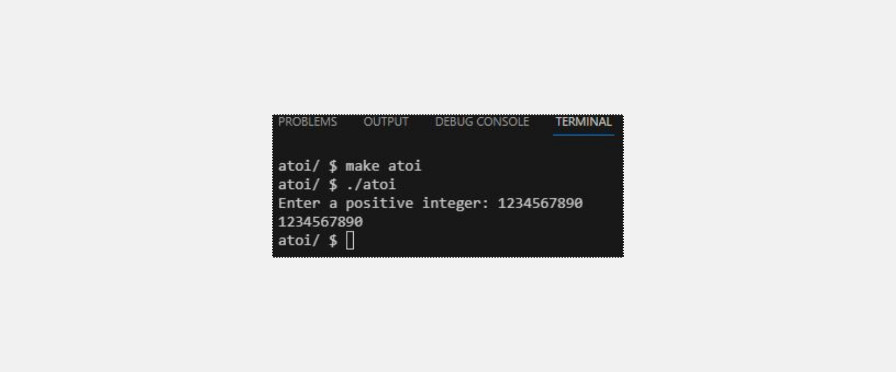
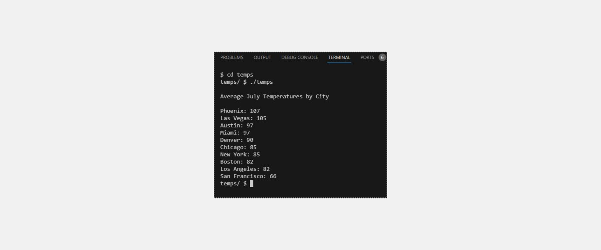
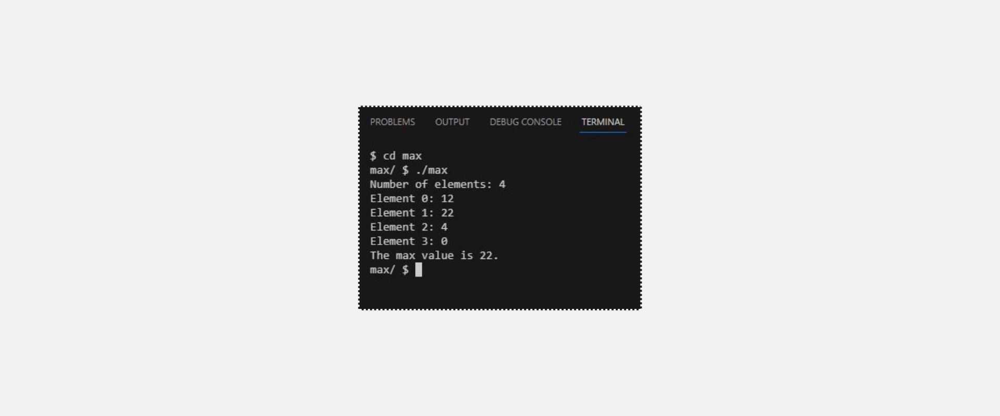
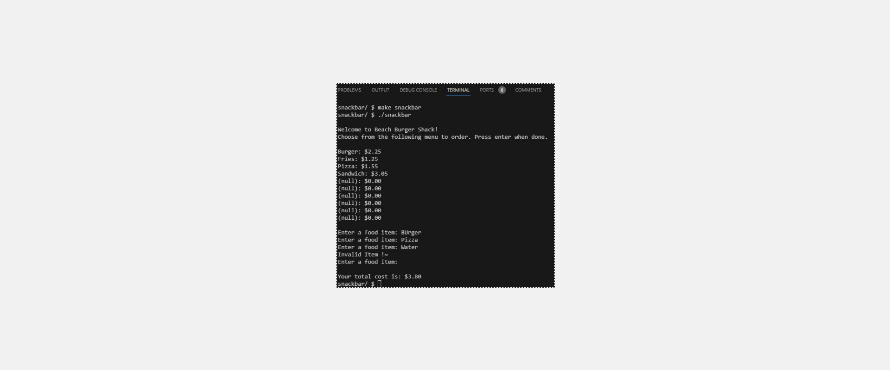

<h1>Recursive atoi</h1>
<h2>Learning Goals</h2>
<ul>
<li>
  Deepen an understanding of strings
</li>
<li>
  Practice creating recursive functions
</li>
</ul>
<h3> Output </h3>

---
<h1>Average High Temperatures</h1>
<h2>Learning Goals</h2>
<ul>
<li>
 Practice working with structs
</li>
<li>
 Practice applying sorting algorithms
</li>
</ul>
<h3> Output </h3>

---

<h1>Max</h1>
<h2>Learning Goals</h2>
<ul>
<li>
Pass an array into a function
</li>
<li>
Create a helper function that finds a maximum value
</li>
</ul>
<h3> Output </h3>

---

<h1>Snackbar</h1>
<h2>Learning Goals</h2>
<ul>
<li>
Practice using structs
</li>
<li>
Write a linear search algorithm
</li>
</ul>
<h3> Output </h3>

