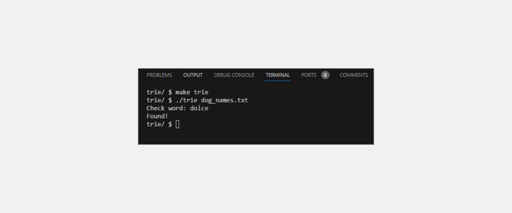

<h1>Trie</h1>
<h2>Learning Goals</h2>
<ul>
<li>Learn more about data structures</li>
<li>Work with a trie</li>
</ul>
<h2>Implementation Details</h2>

Notice that the trie itself is implemented through the creative use of several structs called node. Each node in a trie has an array of (potential) children, with size 26—one potential child for each letter of the alphabet! Adding words to this trie, notice that—for every letter in a word—we create a new node child whose parent is either the root node (for the first letter) or the previous letter (if not the first letter). On the very last letter, we set the is_word attribute of the child node to true. Now, checking if a word is in our trie is as easy as following each letter of that word through our trie. If we get to the final letter and see that is_word is true, well, that name is in our trie!

