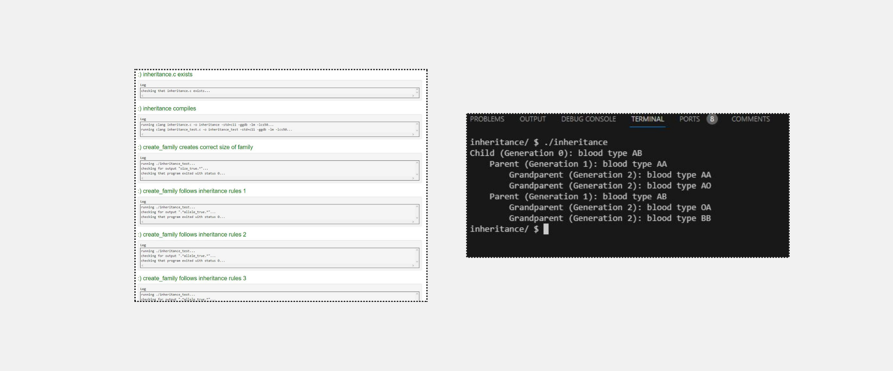

<h1>Lab 5: Inheritance</h1>

<h2>Implementation Details</h2>

Complete the implementation of inheritance.c, such that it creates a family of a specified generation size and assigns blood type alleles to each family member. The oldest generation will have alleles assigned randomly to them.

<ul>
  <li>The create_family function takes an integer (generations) as input and should allocate (as via malloc) one person for each member of the family of that number of generations, returning a pointer to the person in the youngest generation.</li>
  <ul>
    <li>For example, create_family(3) should return a pointer to a person with two parents, where each parent also has two parents.</li>
    <li>Each person should have alleles assigned to them. The oldest generation should have alleles randomly chosen (as by calling the random_allele function), and younger generations should inherit one allele (chosen at random) from each parent.</li>
    <li>Each person should have parents assigned to them. The oldest generation should have both parents set to NULL, and younger generations should have parents be an array of two pointers, each pointing to a different parent.</li>    
  </ul>
</ul>

We’ve divided the create_family function into a few TODOs for you to complete.

<ul>
  <li>First, you should allocate memory for a new person. Recall that you can use malloc to allocate memory, and sizeof(person) to get the number of bytes to allocate.</li>
  <li>Next, we’ve included a condition to check if generations > 1.</li>
  <ul>
    <li>If generations > 1, then there are more generations that still need to be allocated. We’ve already created two new parents, parent0 and parent1, by recursively calling create_family. Your create_family function should then set the parent pointers of the new person you created. Finally, assign both alleles for the new person by randomly choosing one allele from each parent.</li>
        <li>Otherwise (if generations == 1), then there will be no parent data for this person. Both parents of your new person should be set to NULL, and each allele should be generated randomly.</li>
  </ul>
  <li>Finally, your function should return a pointer for the person that was allocated.</li>
</ul>

The free_family function should accept as input a pointer to a person, free memory for that person, and then recursively free memory for all of their ancestors.

<ul>
  <li>Since this is a recursive function, you should first handle the base case. If the input to the function is NULL, then there’s nothing to free, so your function can return immediately.</li>
  <li>Otherwise, you should recursively free both of the person’s parents before freeing the child.</li>
</ul>

