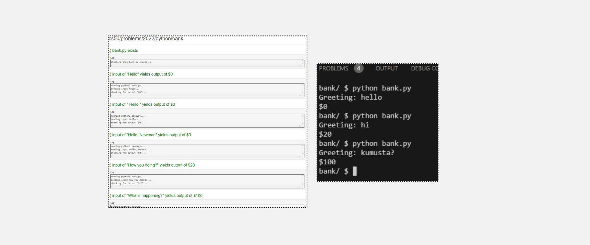
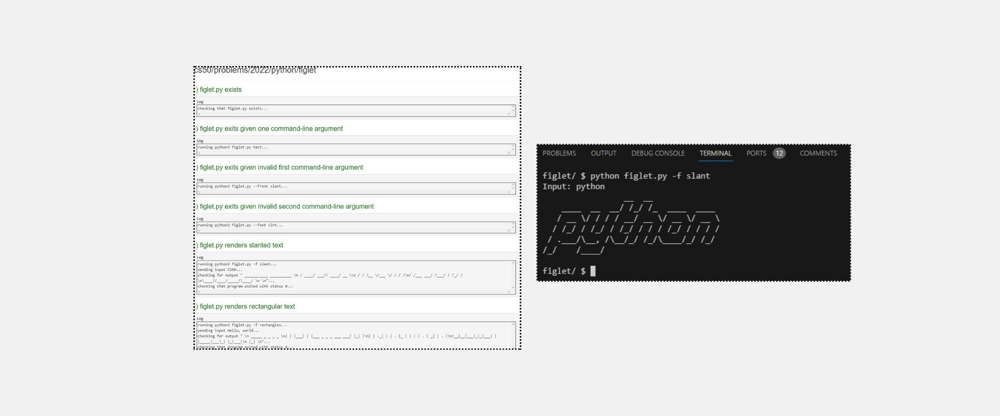

<h1>Practice Problems Set 6</h1>
<h2>Bank</h2>
<h2>Specification</h2>

In a file called bank.py, implement a program that prompts the user for a greeting. If the greeting starts with “hello”, output $0. If the greeting starts with an “h” (but not “hello”), output $20. Otherwise, output $100. Ignore any leading whitespace in the user’s greeting, and treat the user’s greeting case-insensitively.

---
<h2>Frank, Ian and Glen’s Letters</h2>

In a file called figlet.py, implement a program that:

<ul>
<li>Expects zero or two command-line arguments:</li>
<ul>
  <li>Zero if the user would like to output text in a random font.</li>
  <li>Two if the user would like to output text in a specific font, in which case the first of the two should be -f or --font, and the second of the two should be the name of the font.</li>
</ul>
<li>Prompts the user for a str of text.</li>  
<li>Outputs that text in the desired font.</li>
</ul>

---

<h2>Taqueria</h2>

In a file called taqueria.py, implement a program that enables a user to place an order, prompting them for items, one per line, until the user inputs control-d (which is a common way of ending one’s input to a program). After each inputted item, display the total cost of all items inputted thus far, prefixed with a dollar sign ($) and formatted to two decimal places. Treat the user’s input case insensitively. Ignore any input that isn’t an item. Assume that every item on the menu will be titlecased.

