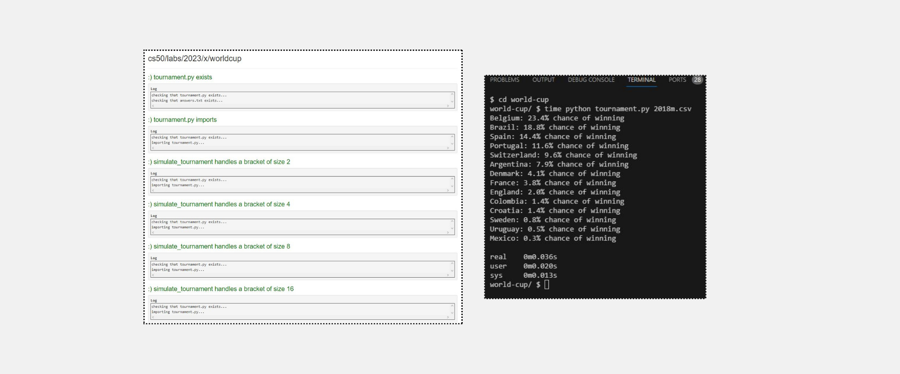
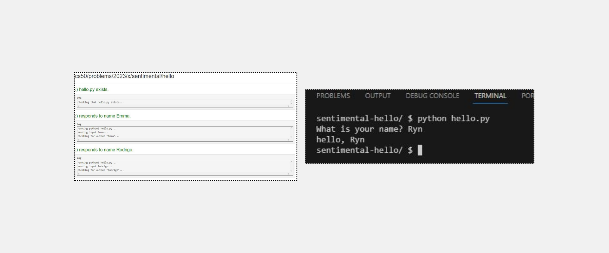
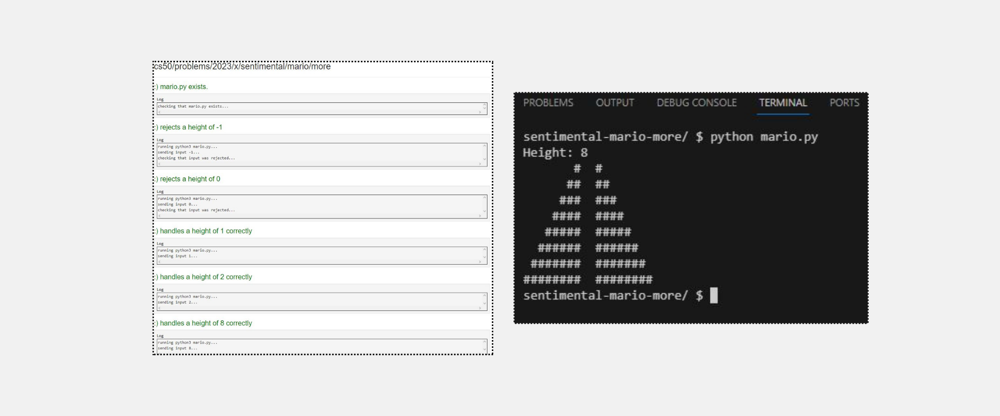
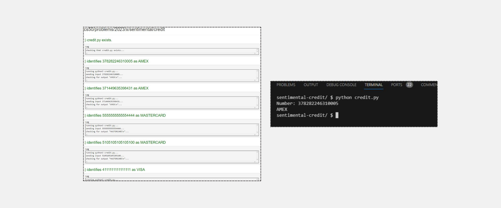
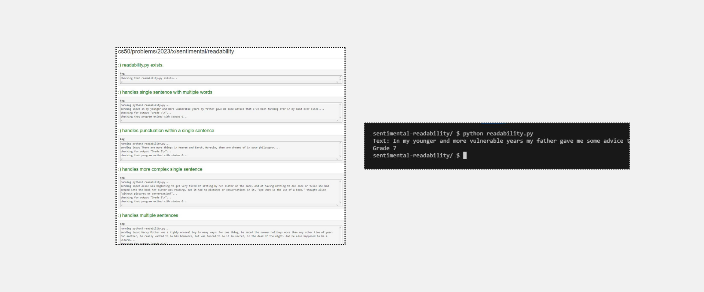

<h1>Lab 6: World Cup</h1>
<h2>Implementation Details</h2>

Complete the implementation of tournament.py, such that it simulates a number of tournaments and outputs each team’s probability of winning.

First, in main, read the team data from the CSV file into your program’s memory, and add each team to the list teams.

<ul>
  <li>The file to use will be provided as a command-line argument. You can access the name of the file, then, with sys.argv[1.</li>
  <li>Recall that you can open a file with open(filename), where filename is a variable storing the name of the file.</li>
  <li>Once you have a file f, you can use csv.DictReader(f) to give you a “reader”: an object in Python that you can loop over to read the file one row at a time, treating each row as a dictionary.</li>
  <li>By default, all values read from the file will be strings. So be sure to first convert the team’s rating to an int (you can use the int function in Python to do this).</li>
  <li>Ultimately, append each team’s dictionary to teams. The function call teams.append(x) will append x to the list teams.</li>
  <li>Recall that each team should be a dictionary with a team name and a rating.</li>
</ul>

Next, implement the simulate_tournament function. This function should accept as input a list of teams and should repeatedly simulate rounds until you’re left with one team. The function should then return the name of that team.

<ul>
  <li>You can call the simulate_round function, which simulates a single round, accepting a list of teams as input and returning a list of all of the winners.</li>
  <li>Recall that if x is a list, you can use len(x) to determine the length of the list.</li>
  <li>You should not assume the number of teams in the tournament, but you may assume it will be a power of 2.</li>
</ul>

Finally, back in the main function, run N tournament simulations, and keep track of how many times each team wins in the counts dictionary.

<ul>
  <li>For example, if Uruguay won 2 tournaments and Portugal won 3 tournaments, then your counts dictionary should be {"Uruguay": 2, "Portugal": 3}.</li>
  <li>You should use your simulate_tournament to simulate each tournament and determine the winner.</li>
  <li>Recall that if counts is a dictionary, then syntax like counts[team_name] = x will associate the key stored in team_name with the value stored in x.</li>
  <li>You can use the in keyword in Python to check if a dictionary has a particular key already. For example, if "Portugal" in counts: will check to see if "Portugal" already has an existing value in the counts dictionary.</li>
</ul>

---

<h1>Problem Set 6</h1>
<h2>Hello</h2>
<h2>Specification</h2>

Write, in a file called hello.py, a program that prompts a user for their name, and then prints hello, so-and-so, where so-and-so is their provided name, exactly as you did in Problem Set 1, except that your program this time should be written in Python.

<h2>Mario</h2>
<h2>Specification</h2>

---

<ul>
  <li>Write, in a file called mario.py, a program that recreates these half-pyramids using hashes (#) for blocks, exactly as you did in Problem Set 1, except that your program this time should be written in Python.</li>
  <li>To make things more interesting, first prompt the user with get_int for the half-pyramid’s height, a positive integer between 1 and 8, inclusive. (The height of the half-pyramids pictured above happens to be 4, the width of each half-pyramid 4, with a gap of size 2 separating them).</li>
  <li>If the user fails to provide a positive integer no greater than 8, you should re-prompt for the same again.</li>
  <li>Then, generate (with the help of print and one or more loops) the desired half-pyramids.</li>
  <li>Take care to align the bottom-left corner of your pyramid with the left-hand edge of your terminal window, and ensure that there are two spaces between the two pyramids, and that there are no additional spaces after the last set of hashes on each row.</li>
</ul>

---

<h2>Credit</h2>
<h2>Specification</h2>
<ul>
  <li>In credit.py, write a program that prompts the user for a credit card number and then reports (via print) whether it is a valid American Express, MasterCard, or Visa card number, exactly as you did in Problem Set 1, except that your program this time should be written in Python.</li>
  <li>So that we can automate some tests of your code, we ask that your program’s last line of output be AMEX\n or MASTERCARD\n or VISA\n or INVALID\n, nothing more, nothing less.</li>
  <li>For simplicity, you may assume that the user’s input will be entirely numeric (i.e., devoid of hyphens, as might be printed on an actual card).</li>
  <li>Best to use get_int or get_string from CS50’s library to get users’ input, depending on how you decide to implement this one.</li>
</ul>

---

<h2>Readability</h2>
<h2>Specification</h2>
<ul>
  <li>Write, in a file called readability.py, a program that first asks the user to type in some text, and then outputs the grade level for the text, according to the Coleman-Liau formula, exactly as you did in Problem Set 2, except that your program this time should be written in Python.</li>
  <ul>
  <li>Recall that the Coleman-Liau index is computed as 0.0588 * L - 0.296 * S - 15.8, where L is the average number of letters per 100 words in the text, and S is the average number of sentences per 100 words in the text.</li>
  </ul>
  <li>Use get_string from the CS50 Library to get the user’s input, and print to output your answer.</li>
  <li>Your program should count the number of letters, words, and sentences in the text. You may assume that a letter is any lowercase character from a to z or any uppercase character from A to Z, any sequence of characters separated by spaces should count as a word, and that any occurrence of a period, exclamation point, or question mark indicates the end of a sentence.</li>
  <li>Your program should print as output "Grade X" where X is the grade level computed by the Coleman-Liau formula, rounded to the nearest integer.</li>
  <li>If the resulting index number is 16 or higher (equivalent to or greater than a senior undergraduate reading level), your program should output "Grade 16+" instead of giving the exact index number. If the index number is less than 1, your program should output "Before Grade 1".</li>
</ul>

---

<h2>DNA</h2>
<h2>Specification</h2>

In a file called dna.py, implement a program that identifies to whom a sequence of DNA belongs.

<ul>
<li>The program should require as its first command-line argument the name of a CSV file containing the STR counts for a list of individuals and should require as its second command-line argument the name of a text file containing the DNA sequence to identify.</li>
<ul>
  <li>If your program is executed with the incorrect number of command-line arguments, your program should print an error message of your choice (with print). If the correct number of arguments are provided, you may assume that the first argument is indeed the filename of a valid CSV file and that the second argument is the filename of a valid text file.</li>
</ul>
<li>Your program should open the CSV file and read its contents into memory.</li>
<ul>
  <li>You may assume that the first row of the CSV file will be the column names. The first column will be the word name and the remaining columns will be the STR sequences themselves.</li>
</ul>
<li>Your program should open the DNA sequence and read its contents into memory.</li>  
<li>For each of the STRs (from the first line of the CSV file), your program should compute the longest run of consecutive repeats of the STR in the DNA sequence to identify. Notice that we’ve defined a helper function for you, longest_match, which will do just that!
</li>  
<li>If the STR counts match exactly with any of the individuals in the CSV file, your program should print out the name of the matching individual.</li>
  <ul>
    <li>You may assume that the STR counts will not match more than one individual.</li>
    <li>If the STR counts do not match exactly with any of the individuals in the CSV file, your program should print No match.</li>
  </ul>
</ul>

