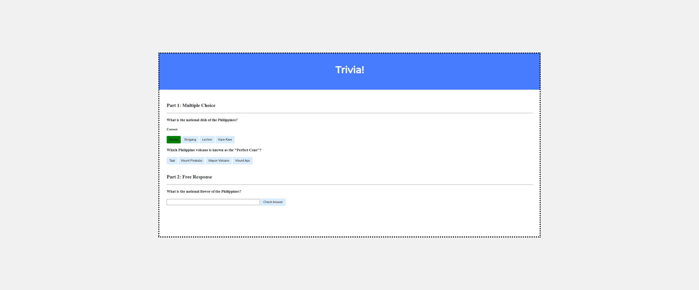

<h1>Lab 8: Trivia</h1>
<h2>Implementation Details</h2>
<p>Design a webpage using HTML, CSS, and JavaScript to let users answer trivia questions.</p>
<ul>
<li>In index.html, add beneath “Part 1” a multiple-choice trivia question of your choosing with HTML.</li>
  <ul>
    <li>You should use an h3 heading for the text of your question.</li>
    <li>You should have one button for each of the possible answer choices. There should be at least three answer choices, of which exactly one should be correct.  </li>
  </ul>
<li>Using JavaScript, add logic so that the buttons change colors when a user clicks on them.</li>
  <ul>
    <li>If a user clicks on a button with an incorrect answer, the button should turn red and text should appear beneath the question that says “Incorrect”.</li>
    <li>If a user clicks on a button with the correct answer, the button should turn green and text should appear beneath the question that says “Correct!”.</li>
  </ul>
<li>In index.html, add beneath “Part 2” a text-based free response question of your choosing with HTML.</li>
  <ul>
  <li>You should use an h3 heading for the text of your question.</li>
  <li>You should use an input field to let the user type a response.</li>
  <li>You should use a button to let the user confirm their answer.</li>
    </ul>
<li>Using JavaScript, add logic so that the text field changes color when a user confirms their answer.</li>
<ul>
<li>If the user types an incorrect answer and presses the confirmation button, the text field should turn red and text should appear beneath the question that says “Incorrect”.</li>
<li>If the user types the correct answer and presses the confirmation button, the input field should turn green and text should appear beneath the question that says “Correct!”.</li>
</ul>
</ul>




---


<h1>Problem Set 8</h1>
<h2>Homepage</h2>
<h2>Specification</h2>
<p>Implement in your homepage directory a website that must:</p>

<ul>
<li>Contain at least four different .html pages, at least one of which is index.html (the main page of your website), and it should be possible to get from any page on your website to any other page by following one or more hyperlinks.</li>
<li>Use at least ten (10) distinct HTML tags besides <html>, <head>, <body>, and <title>. Using some tag (e.g., <p>) multiple times still counts as just one (1) of those ten!</li>
<li>
Integrate one or more features from Bootstrap into your site. Bootstrap is a popular library (that comes with lots of CSS classes and more) via which you can beautify your site. See Bootstrap’s documentation to get started. In particular, you might find some of Bootstrap’s components of interest. To add Bootstrap to your site, it suffices to include</li>
  
```
<link rel="stylesheet" href="https://cdn.jsdelivr.net/npm/bootstrap@4.5.3/dist/css/bootstrap.min.css" integrity="sha384-TX8t27EcRE3e/ihU7zmQxVncDAy5uIKz4rEkgIXeMed4M0jlfIDPvg6uqKI2xXr2" crossorigin="anonymous">
<script src="https://code.jquery.com/jquery-3.5.1.slim.min.js" integrity="sha384-DfXdz2htPH0lsSSs5nCTpuj/zy4C+OGpamoFVy38MVBnE+IbbVYUew+OrCXaRkfj" crossorigin="anonymous"></script>
<script src="https://cdn.jsdelivr.net/npm/bootstrap@4.5.3/dist/js/bootstrap.bundle.min.js" integrity="sha384-ho+j7jyWK8fNQe+A12Hb8AhRq26LrZ/JpcUGGOn+Y7RsweNrtN/tE3MoK7ZeZDyx" crossorigin="anonymous"></script>
```
  
</ul>


