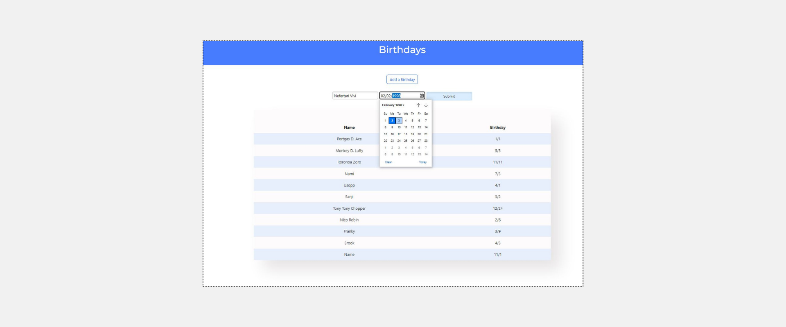

<h1>Lab 9: Birthdays</h1>
<h2>Implementation Details</h2>

Complete the implementation of a web application to let users store and keep track of birthdays.

<ul>
  <li>When the / route is requested via GET, your web application should display, in a table, all of the people in your database along with their birthdays.</li>
  <ul>
    <li>First, in app.py, add logic in your GET request handling to query the birthdays.db database for all birthdays. Pass all of that data to your index.html template.
</li>
    <li>Then, in index.html, add logic to render each birthday as a row in the table. Each row should have two columns: one column for the person’s name and another column for the person’s birthday.</li>
  </ul>

  <li>When the / route is requested via POST, your web application should add a new birthday to your database and then re-render the index page.</li>
  <ul>
    <li>First, in index.html, add an HTML form. The form should let users type in a name, a birthday month, and a birthday day. Be sure the form submits to / (its “action”) with a method of post.
</li>
    <li>hen, in app.py, add logic in your POST request handling to INSERT a new row into the birthdays table based on the data supplied by the user.</li>
  </ul>

</ul>

---
