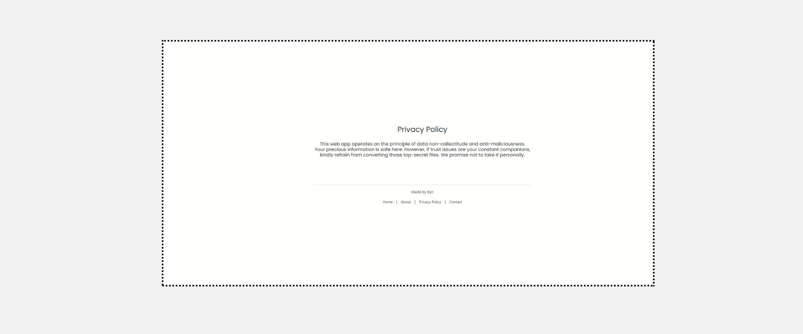
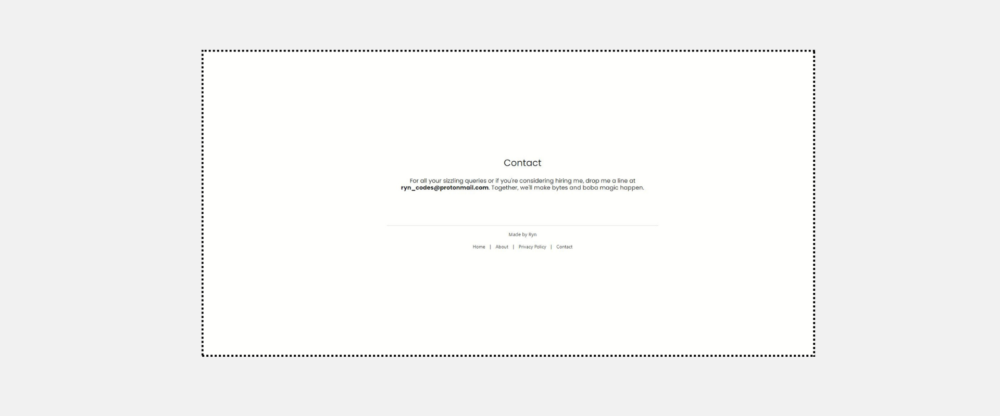

# TASKINATOR
#### Video Demo:  [<URL HERE>](https://www.youtube.com/watch?v=3_ii6eHlnJw)https://www.youtube.com/watch?v=3_ii6eHlnJw
#### Live Demo:  [<URL HERE>](https://taskinator-rg5o.onrender.com)https://taskinator-rg5o.onrender.com
#### Description:
<p>Taskinator is a web app designed to automate repetitive tasks. Users can compress their files into a zip file and upload them to taskinator site, allowing the web app to handle the task. Currently, the app offers two features: converting images and transforming PDFs into docx files.</p>
<br>

---
<h5>For this app to be completed, I used the following technology:</h4>
<br>
 <tr>
    <td align="left">
      <a href="https://www.heroku.com" target="_blank" rel="noreferrer">
        
      </a>
          <a href="https://www.heroku.com" target="_blank" rel="noreferrer">
        
      </a>
          </a>
          <a href="https://www.heroku.com" target="_blank" rel="noreferrer">
        
      </a>
    </a>
     <a href="https://www.heroku.com" target="_blank" rel="noreferrer">
        
      </a>
       <a href="https://www.heroku.com" target="_blank" rel="noreferrer">
        
      </a>
<br>
<br>
<p><em> Necessary libraries & modules :</em> </p>
<br>


```
pip install Flask==3.0.0
```
```
pip install Pillow==10.1.0
```
```
pip install gunicorn==21.2.0
```
```
pip install pdf2docx==0.5.6
```

  </tr>

  ---


  <h3>Homepage</h2>
  
   <h3>Image Converter Page</h2>
     
        <h3>Pdf Converter Page</h2>
            
                    <h4>Footer</h4>
                          
                                
                                      
            


